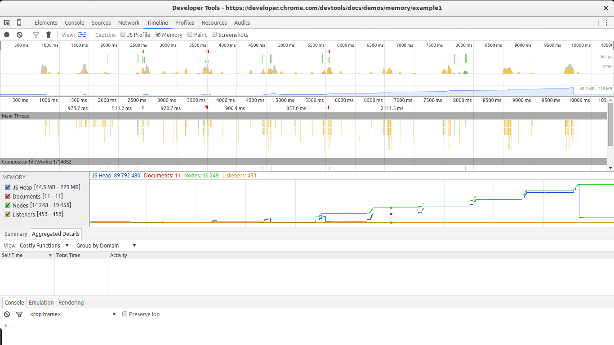
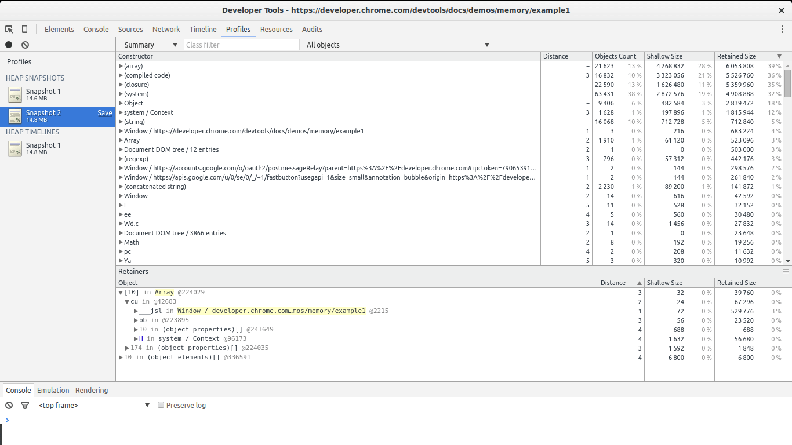
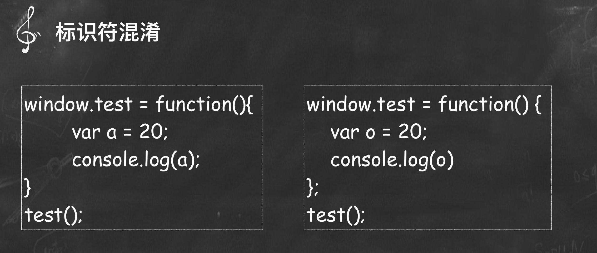
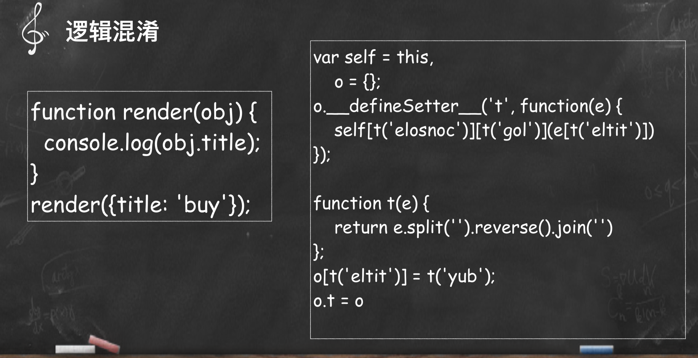
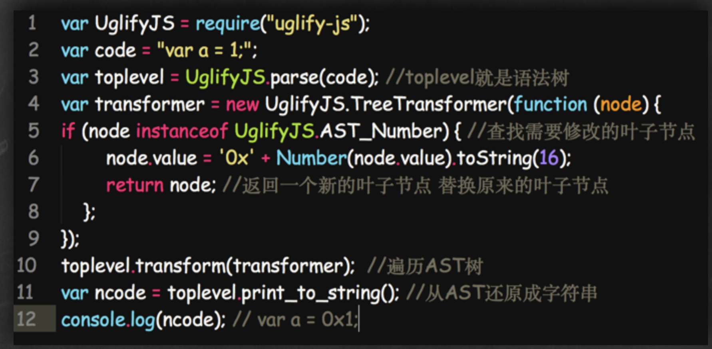

## js 数据类型

*  基本类型(栈 stack) : Number、String 、Boolean、Null 和 Undefined , Symbol(es6 新增)
*  基本数据类型是按值访问 高低分配,栈内存最大是 8MB, String:是特殊的栈内存 ,程序员分配
*  引用类型(堆 heap) :Object 、Array 、Function 、Data
*  引用类型数据在栈内存中保存的实际上是对象在堆内存中的引用地址(指针),向高分配,系统自动分配

##### 堆栈空间分配区别：

> *  栈（操作系统）：由操作系统自动分配释放 ，存放函数的参数值，局部变量的值等。其操作方式类似于数据结构中的栈；
> *  堆（操作系统）： 一般由程序员分配释放，若程序员不释放，程序结束时可能由 OS 回收，分配方式倒是类似于链表。

##### 二、堆栈缓存方式区别：

> *  栈使用的是一级缓存， 他们通常都是被调用时处于存储空间中，调用完毕立即释放；
> *  堆是存放在二级缓存中，生命周期由虚拟机的垃圾回收算法来决定（并不是一旦成为孤儿对象就能被回收）。所以调用这些对象的速度要相对来得低一些。

###### 堆 、栈数据结构区别：

> *  堆（数据结构）：堆可以被看成是一棵树，如：堆排序；
> *  栈（数据结构）：一种先进后出的数据结构。
>     Symbol，表示独一无二的值, Symbol 最大的用途是用来定义对象的唯一属性名;
*  Symbol 值通过 Symbol 函数生成 let symbol1 = Symbol();
*  typeof 运算符用于 Symbol 类型值，返回 symbol;
*  Symbol 不是一个构造函数，如果用 new Symbol 会报错;
*  由于 Symbol 值不是对象，所以不能添加属性;
*  Symbol 值不能与其他类型的值进行运算;
*  Symbol 值可以显式转为字符串，也可以转为布尔值，但是不能转为数值;
*  在对象的内部，使用 Symbol 值定义属性时，Symbol 值必须放在方括号之中，如果不放在方括号中，该属性名就是字符串，而不是代表的 Symbol 值。
*  Symbol 值作为对象属性名时，不能用点运算符。由于点运算符后面总是字符串，所以不会读取 name 作为标识名所指代的那个值，导致属性名实际上是一个字符串，而不是一个 Symbol 值。

## 数据结构

> 数据结构的基本操作的设置的最重要的准则是,实现应用程序与存储结构的独立
> 数据结构:数据的存储+算法
> 

```javascript
数据结构:
    逻辑结构:反映数据之间的逻辑关系;
    存储结构:数据结构在计算机中的表示;
逻辑结构:
        集合:结构中的数据元素除了同属于一种类型外，别无其它关系。(无逻辑关系)
        线性结构 :数据元素之间一对一的关系(线性表)
        树形结构 :数据元素之间一对多的关系(非线性)
        图状结构或网状结构: 结构中的数据元素之间存在多对多的关系(非线性)
存储结构:
        顺序存储数据结构
        链式存储数据结构
        索引存储数据结构
        散列存储数据结构
线性结构 :
* 队列: 也是一种运算受限的线性表。它只允许在表的一端进行插入，而在另一端进行删除。允许删除的一端称为队头(front)，允许插入的一端称为队尾(rear)。先进先出。
* 栈: 是限制在表的一端进行插入和删除运算的线性表，通常称插入、删除的这一端为栈顶(Top)，另一端为栈底(Bottom)。先进后出。top= -1时为空栈，top=0只能说明栈中只有一个元素，并且元素进栈时top应该自增. 后进先出
* 串 :是零个或多个字符组成的有限序列。长度为零的串称为空串(Empty String)，它不包含任何字符。通常将仅由一个或多个空格组成的串称为空白串(Blank String) 注意：空串和空白串的不同，例如“ ”和“”分别表示长度为1的空白串和长度为0的空串。
* 树:一种非线性结构。树是递归结构，在树的定义中又用到了树的概念
    有序数:子节点之间有顺序关系
    无序树:子节点之间没有顺序关系
    二叉树:一种非线性结构。树是递归结构，在树的定义中又用到了树的概念

* 遍历二叉树：使得每一个结点均被访问一次，而且仅被访问一次。非递归的遍历实现要利用栈。
    先序遍历DLR：根节点->左子树->右子树(广度遍历)
    中序遍历LDR：左子树->根节点->右子树。必须要有中序遍历才能得到一棵二叉树的正确顺序(广度遍历)
    后续遍历LRD：左子树->右子树->根节点。需要栈的支持。(广度遍历)
    层次遍历：用一维数组存储二叉树时,总是以层次遍历的顺序存储结点。层次遍历应该借助队列。(深度遍历)
```


内存: 一条很长一维数组;
地址 (门牌号) 指针(指向门牌号) 引用(带路党)

## 算法

#### 算法特征:
有穷性、确定性、可行性、输入、输出

#### 算法设计衡量：
正确性、可读性、健壮性, 时间复杂度, 空间复杂度

#### 算法分类


### 基本算法(必会)
#### 冒泡排序
> 

```javascript
function bubbleSort(arr) {
    var len = arr.length;
    for (var i = 0; i < len - 1; i++) {
        for (var j = 0; j < len - 1 - i; j++) {
            if (arr[j] > arr[j+1]) {        // 相邻元素两两对比
                var temp = arr[j+1];        // 元素交换
                arr[j+1] = arr[j];
                arr[j] = temp;
            }
        }
    }
    return arr;
}
```
#### 快速排序
> 

```javascript
function swap(items, firstIndex, secondIndex){
    var temp = items[firstIndex];
    items[firstIndex] = items[secondIndex];
    items[secondIndex] = temp;
}

function partition(items, left, right) {
    var pivot = items[Math.floor((right + left) / 2)],
        i = left,
        j = right;
    while (i <= j) {
        while (items[i] < pivot) {
            i++;
        }
        while (items[j] > pivot) {
            j--;
        }
        if (i <= j) {
            swap(items, i, j);
            i++;
            j--;
        }
    }
    return i;
}

function quickSort(items, left, right) {
    var index;
    if (items.length > 1) {
        index = partition(items, left, right);
        if (left < index - 1) {
            quickSort(items, left, index - 1);
        }
        if (index < right) {
            quickSort(items, index, right);
        }
    }
    return items;
}

var items = [3,8,7,2,9,4,10]
var result = quickSort(items, 0, items.length - 1);
```
#### 插入排序
> 

```javascript
function insertionSort(arr) {
    var len = arr.length;
    var preIndex, current;
    for (var i = 1; i < len; i++) {
        preIndex = i - 1;
        current = arr[i];
        while(preIndex >= 0 && arr[preIndex] > current) {
            arr[preIndex+1] = arr[preIndex];
            preIndex--;
        }
        arr[preIndex+1] = current;
    }
    return arr;
}
```
#### 选择排序
> 

```javaScript
function selectionSort(arr) {
    var len = arr.length;
    var minIndex, temp;
    for (var i = 0; i < len - 1; i++) {
        minIndex = i;
        for (var j = i + 1; j < len; j++) {
            if (arr[j] < arr[minIndex]) {     // 寻找最小的数
                minIndex = j;                 // 将最小数的索引保存
            }
        }
        temp = arr[i];
        arr[i] = arr[minIndex];
        arr[minIndex] = temp;
    }
    return arr;
}
```

## es5 三剑客

*   this:谁调用 this 指向谁 改变 this 指向 (call apply bind new)
*   闭包: 函数嵌套函数,函数外部的不能引用函数内部的函数变量,函数内部的可以引用函数外部的变量(用完记得回收掉,容易引起内存泄漏)
*   原型:为一群对象添加属性和方法的对象 **proto** 指向根
*   原型链:由原型组成的链式查找
*   继承:复用其他对象的属性和方法,来扩张自己的属性和方法
    > *   函数提升的优先级高于变量
    > *   已经声明的变量再次声明会被忽略
    > *   如果局部变量未被声明引用，者默认声明为全局变量，
*   setTimeout 共有 4 个参数。最后那两个参数，将在 1000 毫秒之后回调函数执行时，作为回调函数的参数. 最小的间隔是 4 毫秒

## prototype __proto__ constructor
把 公用的方法与属性抽离出来 生成一个构造函数，  把抽离出来的方法和属性 通过 prototype 绑定在构造函数上，
如果要继承构造函数的属性与方法 需要通过实例化(new)，实例的方法就继承构造函数的方法与属性，实例的原型对象（__proto__）与构造函数的原型(prototype)对象相同
构造函数.prototype.constructor指向 构造函数
实例的__proto__.constructor 指向  构造函数

#### new 操作符会经历以下四个步骤
>* 创建一个新对象
>* 将构造函数的作用域赋给新对象（因此 this 指向了这个新对象）
>* 执行构造函数中的代码（为这个新对象添加属性）
>* 返回新对象

## 创建对象的方式
>* new
>* object.create()
>* var obe={a:'12'}
>* function(){}

## 判断数据类型的方法
#### typeof 实现原理
>* typeof 一般被用于判断一个变量的类型，我们可以利用 typeof 来判断 number, string, object, boolean, function, undefined,symbol 这七种类型，这种判断能帮助我们搞定一些问题，比如在判断不是 object 类型的数据的时候，typeof 能比较清楚的告诉我们具体是哪一类的类型。但是，很遗憾的一点是，typeof 在判断一个 object 的数据的时候只能告诉我们这个数据是 object, 而不能细致的具体到是哪一种 object
>* null：所有机器码均为 0 typeof null 是 object

#### instanceof 操作符的实现原理
>* instanceof 主要的实现原理就是只要右边变量的 prototype 在左边变量的原型链上即可。因此，instanceof 在查找的过程中会遍历左边变量的原型链，直到找到右边变量的 prototype，如果查找失败，则会返回 false，告诉我们左边变量并非是右边变量的实
>* 原型的链式查找

#### Object.prototype.toString.call()
>* Object.prototype.toString.call(1) // "[object Number]"
>* Object.prototype.toString.call('hi') // "[object String]"
>* Object.prototype.toString.call({a:'hi'}) // "[object Object]"
>* Object.prototype.toString.call([1,'a']) // "[object Array]"
>* Object.prototype.toString.call(true) // "[object Boolean]"
>* Object.prototype.toString.call(() => {}) // "[object Function]"
>* Object.prototype.toString.call(null) // "[object Null]"
>* Object.prototype.toString.call(undefined) // "[object Undefined]"
>* Object.prototype.toString.call(Symbol(1)) // "[object Symbol]"

#### 函数重载
>* 重载就是一组具有相同名字、不同参数列表的函数（方法）
>* 使用 arguments.length 可以实现重载


## Promise
#### 三种状态:
>* pending：进行中
>* fulfilled :已经成功 reslove
>* rejected 已经失败 reject
>* promise 有一个 then 方法， then 方法可以接受 3 个函数作为参数。前两个函数对应 promise 的两种状态 fulfilled 和 rejected 的回调函数,第三个函数用于处理进度信息（对进度回调的支持是可选的）。

#### 原理
```javascript
 var promise = new Promise(function (resolve, reject) {
   if (/* 异步操作成功 */){
     resolve(value);
   } else { /* 异步操作失败 */
     reject(new Error());
   }
 });
```

## enent
>* event.preventDefault()//，是用来阻止点击 a 默认跳转
>* event.stopPropagation()// 该方法将停止事件的传播，阻止它被分派到其他 Document 节点
>* event.stopImmediatePropagation() //函数用于阻止剩余的事件处理函数的执行，并防止当前事件在 DOM 树上冒泡。
>* event.target //返回的是点击的元素节点
>* event.currentTarget //事件属性返回其监听器触发事件的节点，即当前处理该事件的元素、文档或窗口。

## 自定义事件

```javascript
var ev = document.getElementById('ev');
var eve = new Event('custome');
window.addEventListener('custome', function() {
    console.log('custome');
});
setTimeout(function() {
    window.dispatchEvent(eve);
}, 1000);
```

## 内存泄漏
#### 内存泄漏
>* javaScript 会自动垃圾收集，但是如果我们的代码写法不当，会让变量一直处于“进入环境”的状态，无法被回收

#### 那些会引起内存泄漏
*   1.意外的全局变量
*   2.被遗忘的计时器或回调
*   3.超出 DOM 引用
*   4.闭包

#### 内存泄漏检测
> Chrome 内存分析工具

###### Timeline 视图


###### Profile 视图


#### 垃圾回收机制
*   标记清除（mark and sweep）
    >* 1.垃圾回收器，在运行的时候会给存储在内存中的所有变量都加上标记。 2.去掉环境中的变量以及被环境中的变量引用的变量的标记。 3.再被加上标记的会被视为准备删除的变量。 4.垃圾回收器完成内存清除工作，销毁那些带标记的值并回收他们所占用的内存空间。
    > *   大部分浏览器都是使用这种方式进行垃圾回收，区别在于如何标记及垃圾回收间隔而已，只有低版本 IE，不出所料，又是 IE。

*   引用计数(reference counting)
    > 1.  声明了一个变量并将一个引用类型的值赋值给这个变量，这个引用类型值的引用次数就是 1。
    > 2.  同一个值又被赋值给另一个变量，这个引用类型值的引用次数加 1.
    > 3.  当包含这个引用类型值的变量又被赋值成另一个值了，那么这个引用类型值的引用次数减 1.
    > 4.  当引用次数变成 0 时，说明没办法访问这个值了。
    > 5.  当垃圾收集器下一次运行时，它就会释放引用次数是 0 的值所占的内存。

#### 什么时候触发垃圾回收
## 事件队列
> JavaScript 语言的一大特点就是单线程，也就是说，同一个时间只能做一件事

##### 怎么才能多线程
> webworker(html5),
> concurrent.Thread.js

#### 任务可以分成两种:
>*   同步任务(synchronous):在主线程上排队执行的任务 **(执行栈)** ，只有前一个任务执行完毕(入栈出栈)，才能执行后一个任务
>*   异步任务(asynchronous):不进入主线程、而进入"任务队列"(task queue)的任务，只有"任务队列"通知主线程，某个异步任务可以执行了，该任务才会进入主线程执行

#### 任务队列分为:
>*   微任务:process.nextTick, Promises, Object.observe, MutationObserver
>*   任务队列:是一个先进先出的数据结构，排在前面的事件，优先被主线程读取

## [node 相关](https://github.com/Silence520/Documentdescription/tree/master/node%E7%9B%B8%E5%85%B3)

> [node 相关](https://github.com/Silence520/Documentdescription/tree/master/node%E7%9B%B8%E5%85%B3)

## js 设计模式
>*   单例模式
>*   代理模式
>*   命令模式
>*   职责链模式
>*   发布订阅者模式
>*   工厂模式
>*   迭代器模式
>*   适配器模式

## 函数式编程
> 纯函数
> 函数组合 f(g(y(x))
> 函数的柯里化
> Point Free

## 版本更新记录
#### ES6
>*   let const. 字符串模版, 箭头函数, 结构赋值, promise, 默认参数。import(导入) 和 export(导出):

#### ES7
>*   async/await 异步
>*   Users/lihaibo/Library/Application Support/Sublime Text 3/Packages/JSLint
>*   Array.prototype.includes()。 是查找一个值在不在数组里，若在，则返回 true，反之返回 false
>*   3 ** 2 求幂运算符

#### ES8
>*   async function foo() {}
>*   Object.entries() 如果一个对象是具有键值对的数据结构，则每一个键值对都将会编译成一个具有两个元素的数组，这些数组最终会放到一个数组中，返回一个二维数组
>*   Object.values()只返回自己的键值对中属性的值
>*   Object.getOwnPropertyDescriptors()
>*   padStart()。//'x'.padStart(4, 'ab') abax
>*   padEnd()。//'x'.padEnd(4, 'ab') xaba

## babel
>*   Babel 默认只转换新的 JavaScript 句法（syntax），而不转换新的 API，比如 Iterator、Generator、Set、Maps、Proxy、Reflect、Symbol、Promise 等全局对象，以及一些定义在全局对象上的方法（比如 Object.assign）都不会转码。
>*   babel-polyfill 主要包含了 core-js 和 regenerator 两部分
>*   babel-polyfill：提供了如 ES5、ES6、ES7 等规范中 中新定义的各种对象、方法的模拟实现。
>*   regenerator：提供 generator 支持，如果应用代码中用到 generator、async 函数的话用到。

## 错误监控
#### 错误分类

> 1 即时运行错误
###### 捕获错误
>* try ...catch
>* window.onerror()
> 2 资源加载失败
###### 捕获错误
>* object.onerror()(img\ script)
>* performance.getEnries() 返回数组

#### 资源加载失败不能用冒泡得到错误,可以用捕获处理可以到的错误监听
> 捕获错误
> try ...catch
> window.onerror()

### 错误上报
```javascript
(new Image()).src='http://www.baidu.com?sa=we';
navigator.sendBeacon("a.php"); //埋点
```
## 安全
#### 混淆
> 混淆:具体处理为重命名局部变量、在相同语义 的情况下压缩代码，比如去掉末尾分号(Remove Terminator Semicolons)，常量替 换(Constant Propagation)、移除代码空白(Space、Tab、Line-Feed)全局变量 不会更名如 LocalStorage。

#### 常⽤用混淆技术
UglifyJS, JS Packer, Closure Compiler, JS Min





#### 爆破

https://github.com/svent/jsdetox
http://jsnice.org/

```javascript
Number.prototype.constructor.constructor = function(a) {
    console.log('--------');
    console.log(a);
    return Function.apply(null, arguments);
};
```

#### 加密

> 加密重要的目的是出于对商业利益的保护。由于作品太容易被复制窜 改，容易会失去渠道先机
> 加密的目标:减少加密的成本增加破解的成本，需注意 加密后的文件不易过大、没有人工介入不能破解、限制在其他域名部署、不容易被 调试跟踪。

#### 加密算法

> 不基于 key 的算法就是消息双⽅方都通过⼀一定的 加密和解密算法来进⾏行行通信，这种算法缺点很 明显如果加密算法被破解了了就泄露露了
> key 是⼀一个什什么东⻄西呢?随便便你，可以是⼀一个随机产⽣生 的数字，或者⼀一个单词，只要你⽤用的算法认为你选来 做 key 的东⻄西合法就⾏行行。所以基于 key 的加密算法⼜又分 为 2 类:对称加密和不不对称加密

#### 常用的加密手段

base64、md5、 sha1

### AST 语法分析树



> 将代码分析成树状结构, transformer 进行遍历,碰到要替换的进行替换.

#### 常见的攻击

> Web 前端的黑客攻防技术是一门非常新颖且有趣的黑 客技术，主要包含 Web 前端安全的跨站脚本(XSS)、 跨站请求伪造(CSRF)、界面操作劫持、WebShell 这 几大类，涉及的知识点涵盖信任与非信任关系、Cookie 安全、Flash 安全、DOM 渲染、字符集、跨域、原生态 攻击、高级钓鱼、蠕虫思想

#### CSRF 跨站请求

##### 存在问题

> 被黑客抓包，捕获请求地址，直接修改参数。
> 加入验证码，判断 reffer。 这些参数前端都是可以穆 改的。

##### 解决方案

> 验证 Token 请求。每次动 强验证码+动态 Token 请求 态刷新。
> 强验证码+动态 Token 请求

#### 跨站脚本(XSS)


payload
xsser

###### 跨站脚本(XSS)防患


