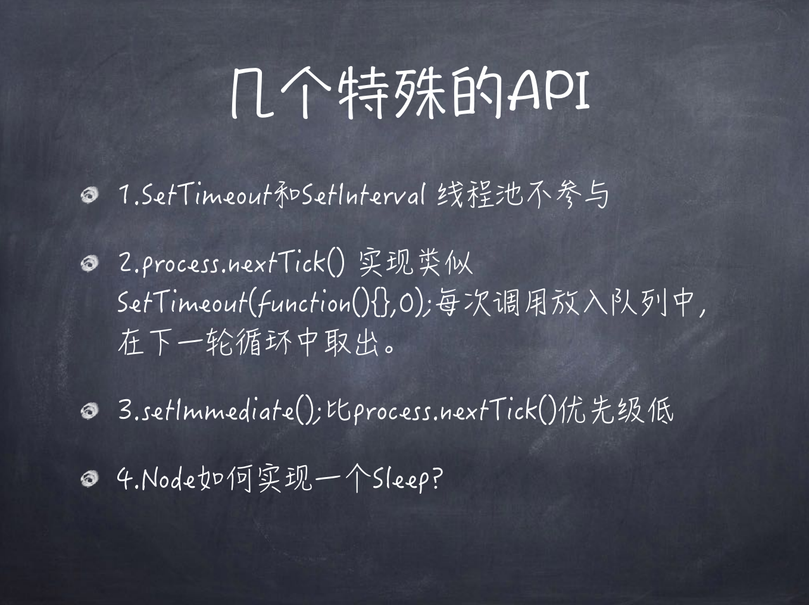
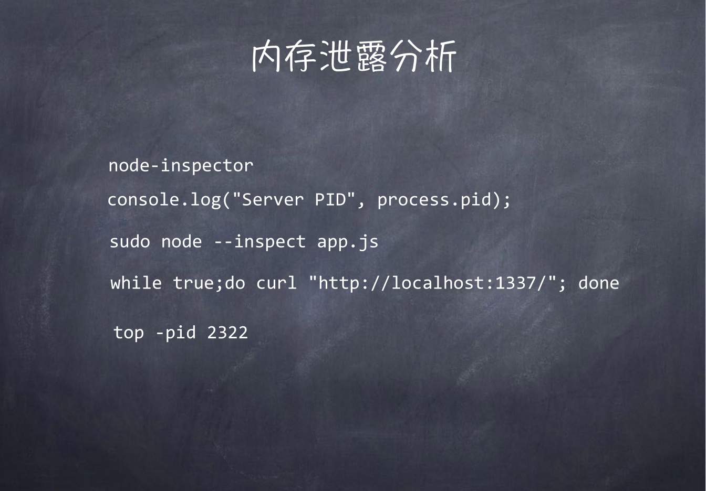

## node架构 优化
>* IO密集型：大量的输入输出；
>* CUP密集型 :大量的计算；
#### 异步IO的好处
>* 1前端通过异步IO可以消除UI堵塞
>* 2IO是昂贵的 异步IO是更加昂贵的
>* 3node.js适合IO密集型不适用cup密集型	
####  eventLoop

* libuv : 管理通知；liunx 轮循通知  custom threadpool 、 windows 事件通知 IOCP
* pm2 :塞满进程 进程守护
* custor ：都是一样各自独立 
* fork:复制 主的一挂全都完了

* setTimeout,setInterval现成池不参与
* process.nextTick()
* 高阶函数：把函数当做参数或者返回值为函数的函数

### 控制异步手段

>* 1.Async Await
>* 2.promise/Defferred
>* 3.step,wind ,bigpipe,Q.js

#### node内存管理

* node使用javascript在服务端操作大内存对象收到了一定的限制64位： 1.4G ;32位：0.7G

#### 垃圾回收机制

* 主要为：标记清除
* 新生代：scavenge 
* 新生代被回收过一次 发现to的使用空间超过25%晋升到老生代
* 老生代：mark-sweep标记  mark-compact
* v8后续还延续了 延迟处理， 增量处理 计划引入并行标记处理；

### node 常见的内存泄漏

>* 1.无线增长的数组
>* 2.无线设置属性和值
>* 3.任何模块内的私有变量和方法均是永驻内存的a=null
>* 4.大循环 无gc机会

#### 检测内存泄漏

- AOP:面向对象
- IOC：控制反转
- DI：依赖注入
