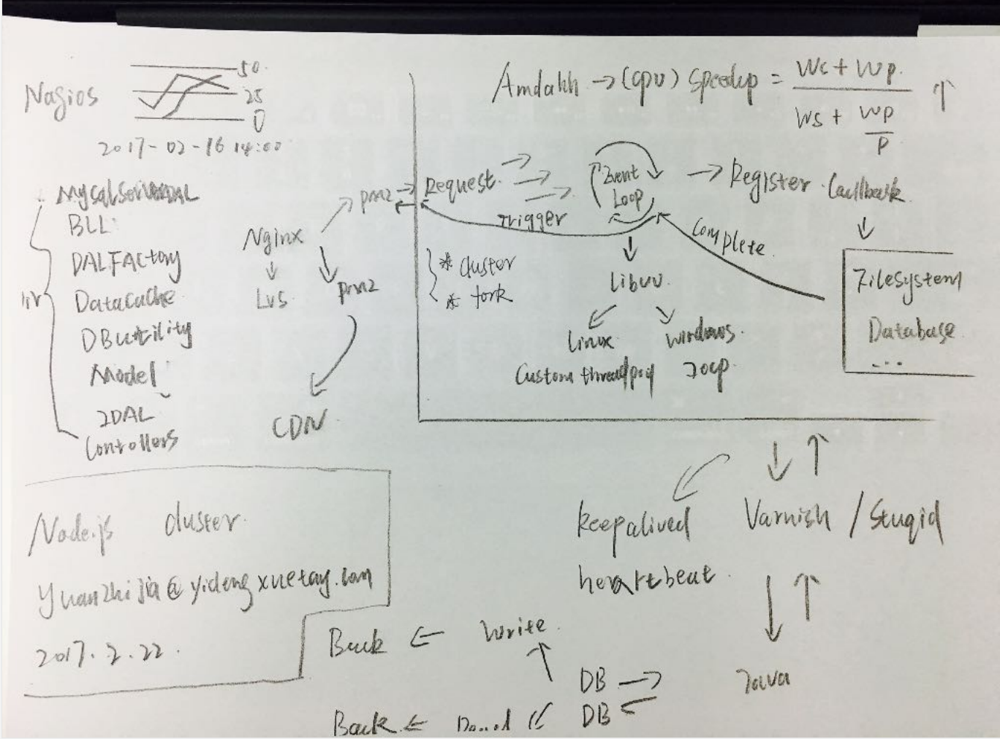
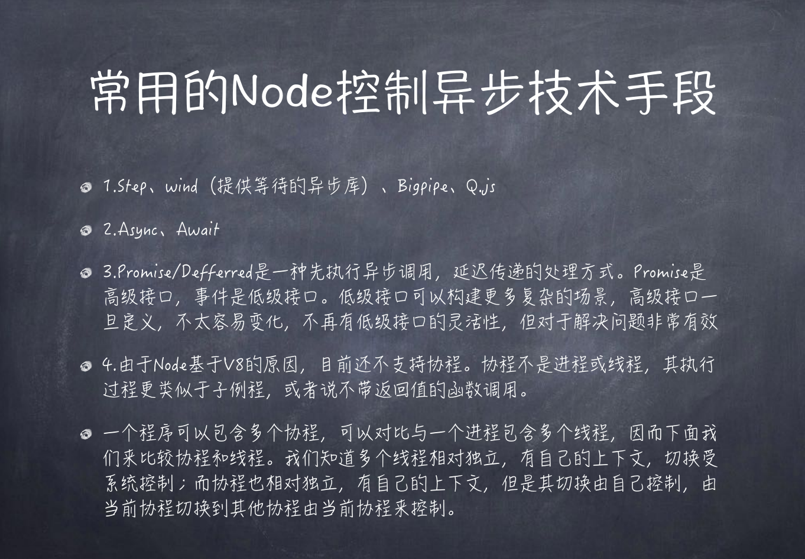
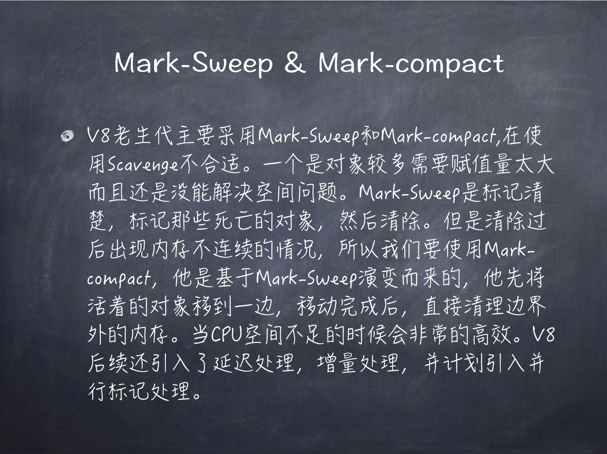

## node 架构 优化

> -   IO 密集型：大量的输入输出；
> -   CUP 密集型 :大量的计算；

#### 异步 IO 的好处

> -   1 前端通过异步 IO 可以消除 UI 堵塞
> -   2IO 是昂贵的 异步 IO 是更加昂贵的
> -   3node.js 适合 IO 密集型不适用 cup 密集型

#### eventLoop

-   libuv : 管理通知；liunx 轮循通知 custom threadpool 、 windows 事件通知 IOCP
-   pm2 :塞满进程 进程守护
-   custor ：都是一样各自独立
-   fork:复制 主的一挂全都完了
    
-   setTimeout,setInterval 现成池不参与
-   process.nextTick()
-   高阶函数：把函数当做参数或者返回值为函数的函数

### 控制异步手段

> -   原始 jquery 时代：deferred Q.js Wind Bigpipe bluebird（node 已经实现）
> -   然后 es6 的时代：generator 和 yield next
> -   然后 promise then
> -   然后 es7 的时代：async await

#### node 内存管理

-   node 使用 javascript 在服务端操作大内存对象收到了一定的限制 64 位： 1.4G ;32 位：0.7G

#### 垃圾回收 GC 包括三个主要步骤

> 1.枚举根节点的引用 2.发现并标记活对象 3.垃圾内存清理

#### 垃圾回收机制

#### 分代回收在 V8 中分为 Scavenge mark-sweep

> scavenge：当分配指针达到了新生区的末尾，就会有一次清理
> 这个算法的大概意思是：新生区被分为两个等大的区（from 和 to），绝大多数内存的分配都会出现在 from 区（但是某些可执行的代码对象是分配在老生区的），当 from 区耗尽时，我们交换 from 和 to，然后将 from 区中活跃的对象复制到 to 区或者晋升到老生区中，其中标记的过程时深度优先搜索！
> 新生代被回收过一次 发现 to 的使用空间超过 25%晋升到老生代
> 缺点：scavenge 算法对于快速回收和紧缩内存效果很好，但是对于大片内存则消耗过大，频繁的拷贝对于 cpu 是不可承受之重，老生区包含有上百 M 的数据，对于这种区域我们采用标记-清除，标记-压缩算法

###### mark-sweep mark-compact

> 清理算法很简单：遍历页的位图，搜索连续的死对象释放，时间久了就会形成内存碎片
> 紧缩算法：尝试将对象从碎片页中迁移整合在一起，来释放内存，这些对象会被迁移到另外的页上，因为也可能会重新分配一些页面。alinode 对此策略进行了优化

-   主要为：标记清除
-   新生代：scavenge
-   新生代被回收过一次 发现 to 的使用空间超过 25%晋升到老生代
-   老生代：mark-sweep 标记 mark-compact
-   v8 后续还延续了 延迟处理， 增量处理 计划引入并行标记处理；

### node 常见的内存泄漏

> -   1.无线增长的数组
> -   2.无线设置属性和值
> -   3.任何模块内的私有变量和方法均是永驻内存的 a=null
> -   4.大循环 无 gc 机会

#### 检测内存泄漏

-   AOP:面向对象
-   IOC：控制反转
-   DI：依赖注入
