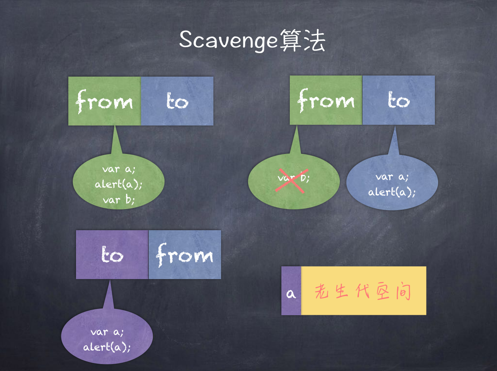
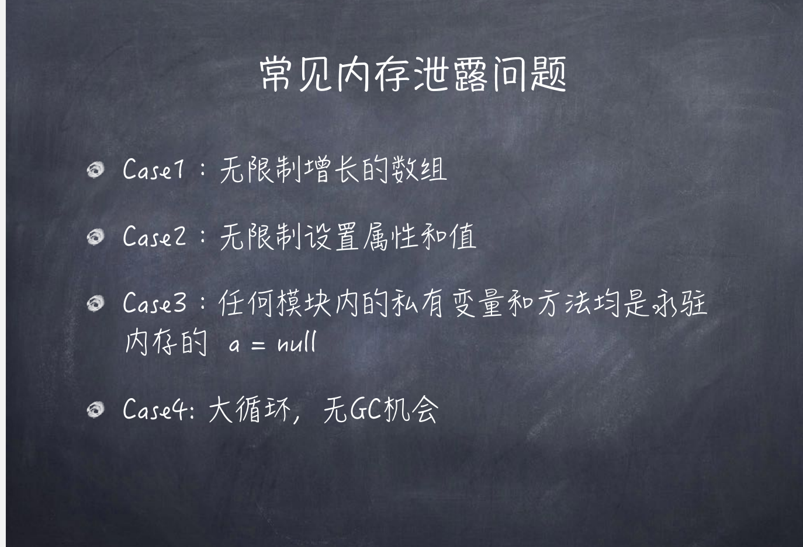

## node架构 优化
>* IO密集型：大量的输入输出；
>* CUP密集型 :大量的计算；
#### 异步IO的好处
>* 1前端通过异步IO可以消除UI堵塞
>* 2IO是昂贵的 异步IO是更加昂贵的
>* 3node.js适合IO密集型不适用cup密集型	
####  eventLoop

* libuv : 管理通知；liunx 轮循通知  custom threadpool 、 windows 事件通知 IOCP
* pm2 :塞满进程 进程守护
* custor ：都是一样各自独立 
* fork:复制 主的一挂全都完了

* setTimeout,setInterval现成池不参与
* process.nextTick()
* 高阶函数：把函数当做参数或者返回值为函数的函数

### 控制异步手段

>* 原始jquery时代：deferred   Q.js Wind Bigpipe
>* 然后es6的时代：generator 和yield next
>* 然后promise then
>* 然后es7的时代：async await

#### node内存管理

* node使用javascript在服务端操作大内存对象收到了一定的限制64位： 1.4G ;32位：0.7G

#### 垃圾回收GC包括三个主要步骤
> 1.枚举根节点的引用
> 2.发现并标记活对象
> 3.垃圾内存清理

#### 垃圾回收机制

#### 分代回收在V8中分为 Scavenge mark-sweep
> scavenge：当分配指针达到了新生区的末尾，就会有一次清理
> 这个算法的大概意思是：新生区被分为两个等大的区（from和to），绝大多数内存的分配都会出现在from区（但是某些可执行的代码对象是分配在老生区的），当from区耗尽时，我们交换from和to，然后将from区中活跃的对象复制到to区或者晋升到老生区中，其中标记的过程时深度优先搜索！
> 新生代被回收过一次 发现to的使用空间超过25%晋升到老生代
> 缺点：scavenge算法对于快速回收和紧缩内存效果很好，但是对于大片内存则消耗过大，频繁的拷贝对于cpu是不可承受之重，老生区包含有上百M的数据，对于这种区域我们采用标记-清除，标记-压缩算法
###### mark-sweep  mark-compact
>清理算法很简单：遍历页的位图，搜索连续的死对象释放，时间久了就会形成内存碎片
> 紧缩算法：尝试将对象从碎片页中迁移整合在一起，来释放内存，这些对象会被迁移到另外的页上，因为也可能会重新分配一些页面。alinode对此策略进行了优化

* 主要为：标记清除
* 新生代：scavenge 
* 新生代被回收过一次 发现to的使用空间超过25%晋升到老生代
* 老生代：mark-sweep标记  mark-compact
* v8后续还延续了 延迟处理， 增量处理 计划引入并行标记处理；

### node 常见的内存泄漏

>* 1.无线增长的数组
>* 2.无线设置属性和值
>* 3.任何模块内的私有变量和方法均是永驻内存的a=null
>* 4.大循环 无gc机会

#### 检测内存泄漏

- AOP:面向对象
- IOC：控制反转
- DI：依赖注入
