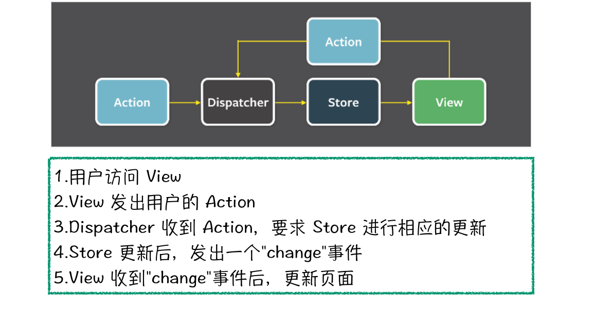
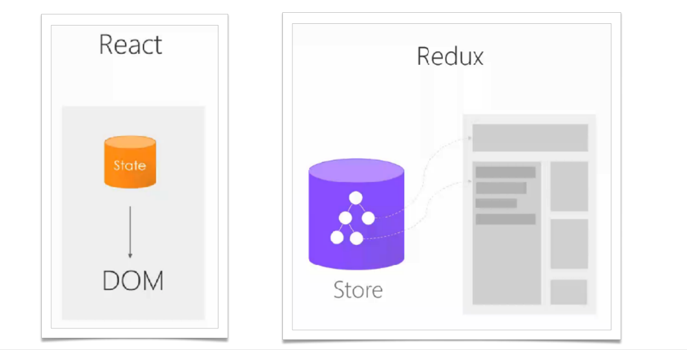

## react && redux 浅析

-   React 本身只涉及 UI 层 如果搭建大型应用，必须搭配一个前端框架
-   Flux 是一种架构思想 ，专门解决软件结构的问题，它跟 mvc 架构是同一类东西，更加简单清晰
-   批处理：批处理就是对某对象进行批量的处理，通常被认为是一种简化的脚本语言
-   事务： 一个事务是一个不可分割的工作单位，事务中包括的诸操作要么都做，要么都不做 , react 的 setState 同步线程执行

#### setState 执行

-   Stack reconcile 会深度优先遍历所有的 Virtual DOM 节点，进行 Diff。它一定要等整棵 Virtual DOM 计算完成之后，才将任务出栈释放主线程所以，在浏览器主线程被 React 更新状态任务占据的时候，用户与浏览器进行任何的交互都不能得到反馈，只有等到任务结束，才能突然得到浏览器的响应。
-   react16 :为解决 setState 阻塞 而 React Fiber ReactDOMFiber.render();
-   Reactdomfiber.render(Fiberexample/>, document. getelementbyid('app-container')
-   Reconciler 就是我们所说的 Virtul DOM,用于计算新老 ∨iew 的差异。React16 之前的 Reconciler 叫叫 Stack reconciler。 Fiber 是 React 的新 reconciler。
-   Renderer 则是和平台相关的代码,负责将 ∨ew 的变化渲染到不同的平台上 DOM、 Canvas、 Native、VR、 Webgl 等等平台都有自己的 renderer。我们
    可以看出 reconciler 是 Reac 的核心代码,是各个平台共用的。因此这次 React 的 reconciler 更新到 Fiber 架构是一次重量级的核心架构的更换

### 生命周期

-   getDefaultProps() 设置默认的 props，也可以用 dufaultProps 设置组件的默认属性.
-   getInitialState() 在使用 es6 的 class 语法时是没有这个钩子函数的，可以直接在 constructor 中定义 this.state。此时可以访问 this.props.
-   componentWillMount() 组件初始化时只调用，以后组件更新不调用，整个生命周期只调用一次，此时可以修改 state.
-   render() react 最重要的步骤，创建虚拟 dom，进行 diff 算法，更新 dom 树都在此进行。此时就不能更改 state 了.
-   componentDidMount() 组件渲染之后调用，只调用一次.
-   componentWillReceiveProps() 组件初始化时不调用，组件接受新的 props 时调用.
-   shouldComponentUpdate(nextProps, nextState) react 性能优化非常重要的一环。组件接受新的 state 或者 props 时调用，我们可以设置在此对比前后两个 props 和 state 是否相同，如果相同则返回 false 阻止更新，因为相同的属性状态一定会生成相同的 dom 树，这样就不需要创造新的 dom 树和旧的 dom 树进行 diff 算法对比，节省大量性能，尤其是在 dom 结构复杂的时候.
-   componentWillUpdata(nextProps, nextState) 组件初始化时不调用，只有在组件将要更新时才调用，此时可以修改 state.
-   render 组件渲染.
-   componentDidUpdate() 组件初始化时不调用，组件更新完成后调用，此时可以获取 dom 节点.
-   componentWillUnmount() 组件将要卸载时调用，一些事件监听和定时器需要在此时清除.

### Fiber

-   Fiber 是一种轻量的执行线程，同线程一样共享定址空间，线程靠系统调度，并且是抢占式多任务处理，Fiber 则是自调用，协作式多任务处理。

#### Fiber Reconcile 与 Stack Reconcile 主要有两方面的不同。

-   首先，使用协作式多任务处理任务。将原来的整个 Virtual DOM 的更新任务拆分成一个个小的任务。每次做完一个小任务之后，放弃一下自己的执行将主线程空闲出来，看看有没有其他的任务。如果有的话，就暂停本次任务，执行其他的任务，如果没有的话，就继续下一个任务。

#### Fiber 整个页面更新并重渲染过程分为两个阶段。

-   由 reconcile 和 renderer 两个概念引出的是 phase 的概念。 Phase 指的是 Reac 组件渲染时的阶段
    > -   Reconcile 阶段。此阶段中，依序遍历组件，通过 diff 算法，判断组件是否需要更新，给需要更新的组件加上 tag。遍历完之后，将所有带有 tag 的组件加到一个数组中。这个阶段的任务可以被打断。
    > -   Commit 阶段。根据在 Reconcile 阶段生成的数组，遍历更新 DOM，这个阶段需要一次性执行完。如果是在其他的渲染环境 -- Native，硬件，就会更新对应的元素。

## flux

-   Web 应用是一个状态机，视图与状态是一一对应的。
-   所有的状态，保存在一个对象里面。

view :视图层
Action：动作
dispatcher：派发起
store：数据

### 应用

-   Store 就是保存数据的地方，你可以把它看成一个容器。整个应用只能有一个 Store。

> -   store.getState() 获取 state
> -   store.dispatch() 触发 state
> -   store.subscribe() 注册 state 变化监听
> -   createStore(reducer,[initialstate]) 创建
>     Redux 规定， 一个 State 对应一个 View。只要 State 相同，View 就相同。你知道 State，就知道 View 是什么样，反之亦然。

## Redux

##版本更新记录

#### react16

> -   React 16 采用了称为“Fiber”的全新的内部架构。官方对 Fiber 的一句话解释是“React Fiber 是对核心算法的一次重新实现
> -   render 方法能够返回数组了 //但是要使用 key
> -   ReactDOM.createPortal //新增了一个顶级 API
> -   setState 传入 null 时不会再触发更新
> -   componentDidCatch(error, info) 的生命周期函数，你可以定义组件的错误处理函数，这样组件在遇到运行时错误时会像增加了 try...catch 一样，不会将错误直接抛出了，错误被局部组件 catch 住，保证了整个应用的可用性。
> -   react 是 5.3kb（gzip：2.2kb），之前是 20.7kb（gzip：6.9kb）
> -   react-dom 是 103.7kb（gzip：32.6kb），之前是 141kb（gzip：42.9kb）
> -   react + react-dom 是 109kb（gzip：34.8kb），之前是 161.7kb（gzip：49.8kb）

#### react 16.3

> -   React.createContext()，这样就创建了两个组件：
> -   要被废弃的方法：
> -   componentWillMount--使用 componentDidMount 代替
> -   componentWillUpdate--使用 componentDidUpdate 代替
> -   componentWillReceiveProps--使用一个新的方法：static getDerivedStateFromProps 来代替。

#### react-router4

> -   所有组件更改为从 react-router-dom 导入
> -   v2 import {Router,Route,hashHistory} from 'react-router';
> -   在 react-router4 开始,所有的 router 组件均是从 react-router-dom 中导入, 所以一下的需要更改为以下代码:
> -   v4 import {Route,BrowserRouter, Switch} from 'react-router-dom
> -   将所有<Router>替换为<BrowserRouter>. 只能有一个子节点

#### 小程序注意点

> -   任何情况下的视图更新只能通过 setData()
> -   路径只能是十层。
> -   不要直接对 Page.data 进行修改，请使用 Page.setData
> -   跳转到 tabbar 页面一定要用 wx.switchTab()
> -   使用 wx:for 遍历的时候最好加上 wx:key=”{{index}}”
> -   input 组件的宽度使用百分比，设置 placeholder 的文本 text-align：canter，这时文字并不会正常居中。原来 input 设置百分比， placeholder 就不支持设置 text-align 样式了，想实现居中，就只能把 input 的长度写死。
