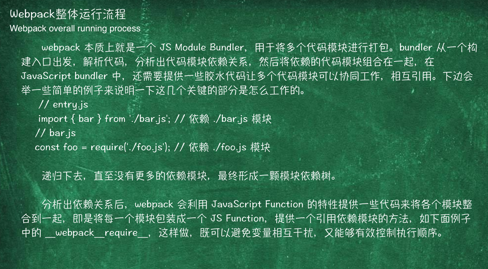
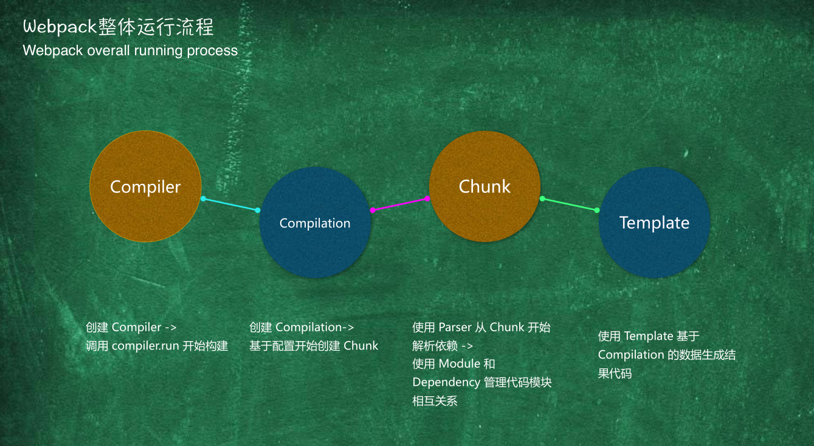

## webpack 解析


> happypack:多核打包，加快	打包速度    
> 原理 nodejs 多线程模块 cluster
#### AST(静态语法分析树)
> uglify ,acorn(webpack)


##### 为什么parcel比webpack 快？
> webpack 先解析成字符串 然后字符串解析成 AST(静态语法分析树)  (acorn)
> parcel 直接解析AST(静态语法分析树)

#### loader 
> Loaders是webpack提供的最激动人心的功能之一了。通过使用不同的loader，webpack有能力调用外部的脚本或工具，实现对不同格式的文件的处理，比如说分析转换scss为css，或者把下一代的JS文件（ES6，ES7)转换为现代浏览器兼容的JS文件，对React的开发而言，合适的Loaders可以把React的中用到的JSX文件转换为JS文件。

##### 实现机制
webpack 先解析成字符串 然后字符串解析成 AST(静态语法分析树)  (acorn)

```bash
moduel.exports=function(content,map,meta){
     console.log('得到的数据：‘， content);
     console.log('loader预选处理‘， this.data.value);
}

moduel.exports.pitch=function(r1,r2,data){
     data.value='hello moto';
}

```

#### Plugins
> 插件（Plugins）是用来拓展Webpack功能的，它们会在整个构建过程中生效，执行相关的任务
> Loaders和Plugins常常被弄混，但是他们其实是完全不同的东西，可以这么来说，loaders是在打包构建过程中用来处理源文件的（JSX，Scss，Less..），一次处理一个，插件并不直接操作单个文件，它直接对整个构建过程其作用。

```bash
	const pluginName = 'ConsoleLogOnBuildWebpackPlugin';
	class ConsoleLogOnBuildWebpackPlugin {//
			apply(compiler) {
			// 在 compiler的hooks中注册⼀个⽅法，当执⾏到该阶段时会调⽤
			compiler.hooks.run.tap(pluginName, compilation => { //运行时
				console.log("The webpack build process is starting!!!");
			});
		}
	}


	plugins: [
		new ConsoleLogOnBuildWebpackPlugin()
	]
```

##### 实现机制
webpack 利用了 tapable 这个库（https://github.com/webpack/tapable）来协助实现对于整个
构建流程各个步骤的控制。 tapable 定义了主要构建流程后，使用 tapable 这个库添加了各种各样的
钩子方法来将 webpack 扩展至功能十分丰富,这就是plugin 的机制。


### Webpack整体运行流程






##### webpack5 废除 happypack     


 