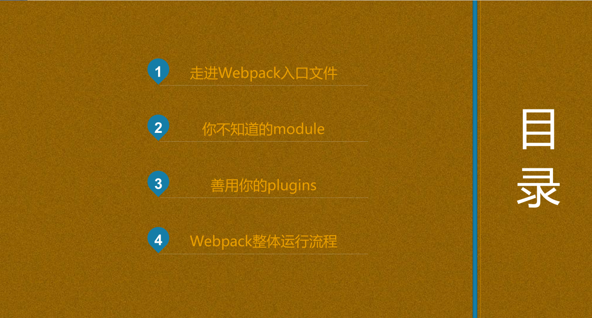
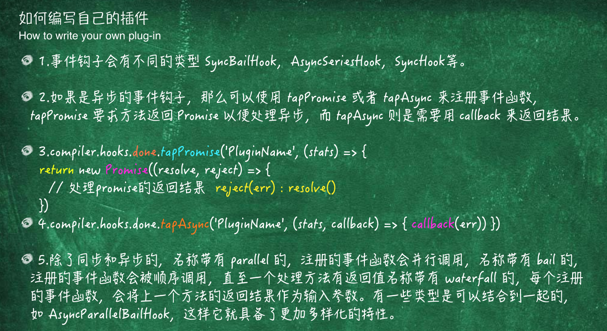
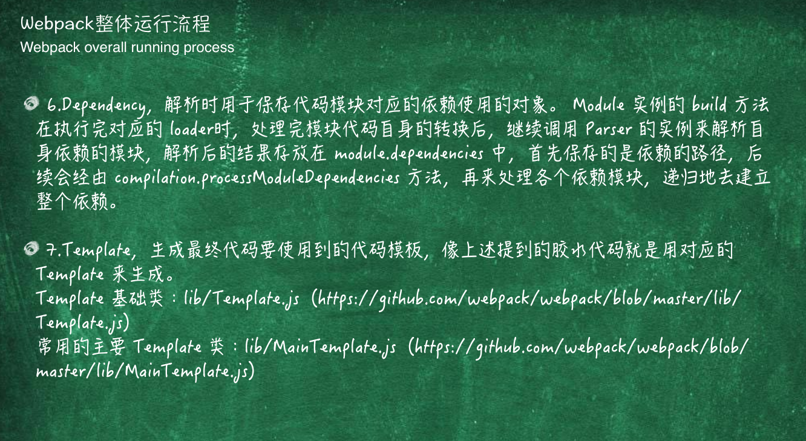

## webpack 解析




> happypack:多核打包，加快 打包速度  
> 原理 nodejs 多线程模块 cluster

#### AST(静态语法分析树)

> uglify ,esprima,acorn(webpack)
> 

##### 为什么 parcel 比 webpack 快？

> webpack 先解析成字符串 然后字符串解析成 AST(静态语法分析树) (acorn)
> parcel 直接解析 AST(静态语法分析树)

#### loader

> Loaders 是 webpack 提供的最激动人心的功能之一了。通过使用不同的 loader，webpack 有能力调用外部的脚本或工具，实现对不同格式的文件的处理，比如说分析转换 scss 为 css，或者把下一代的 JS 文件（ES6，ES7)转换为现代浏览器兼容的 JS 文件，对 React 的开发而言，合适的 Loaders 可以把 React 的中用到的 JSX 文件转换为 JS 文件。

##### 实现机制

webpack 先解析成字符串 然后字符串解析成 AST(静态语法分析树) (acorn)

```bash
moduel.exports=function(content,map,meta){
     console.log('得到的数据：‘， content);
     console.log('loader预选处理‘， this.data.value);
}

moduel.exports.pitch=function(r1,r2,data){
     data.value='hello moto';
}
```

#### Plugins

> 插件（Plugins）是用来拓展 Webpack 功能的，它们会在整个构建过程中生效，执行相关的任务
> Loaders 和 Plugins 常常被弄混，但是他们其实是完全不同的东西，可以这么来说，loaders 是在打包构建过程中用来处理源文件的（JSX，Scss，Less..），一次处理一个，插件并不直接操作单个文件，它直接对整个构建过程其作用。
> 

```bash
	const pluginName = 'ConsoleLogOnBuildWebpackPlugin';
	class ConsoleLogOnBuildWebpackPlugin {//
			apply(compiler) {
			// 在 compiler的hooks中注册⼀个⽅法，当执⾏到该阶段时会调⽤
			compiler.hooks.run.tap(pluginName, compilation => { //运行时
				console.log("The webpack build process is starting!!!");
			});
		}
	}


	plugins: [
		new ConsoleLogOnBuildWebpackPlugin()
	]
```

##### 实现机制

webpack 利用了 tapable 这个库（https://github.com/webpack/tapable）来协助实现对于整个
构建流程各个步骤的控制。 tapable 定义了主要构建流程后，使用 tapable 这个库添加了各种各样的
钩子方法来将 webpack 扩展至功能十分丰富,这就是 plugin 的机制。

### Webpack 整体运行流程





##### webpack5 废除 happypack

#### webpack 性能优化：

> 经历多个 web 项目实战之后，归纳 webpack 缺陷 1.代码全量构建速度过慢，即使是很小的改动，也要等待很长时间才能查看更新与编译之后的结果（引入 HMR 热更新之后有明显的改进） 2.随着项目业务的复杂度增加，工程模块的体积也会急剧增大，构建后的模块通常要以 M 为单位计算 3.多个项目之间公用基础资源存在重复打包，基础库代码复用率不算太高
> 4.node 的单进程实现在 CPU 计算型的 loader 中表现不佳

#### webpack 分析工具

webpack-bundle-analyzer：自动帮你计算出各个模块在你的项目中的依赖和分部情况

#### 优化建议：

> 1.利用 dllPlugin 和 dllReferencePlugin 预编译资源模块：因为 npm 包不会进行修改，所以构建的时候没必要每次都去解析 2.使用 happypack 加速代码构建--开启多线程：happypack 在编译过程中除了利用多进程的模式加速编译，还同时开启了 cache 计算，能充分利用缓存读取构建文件 3.增加 uglify，在构建的时候发现，webpack build 走到 80%左右的时候，会发生很长时间的停滞，经测试对比发现正是 uglifyJS 在对我们 output 中的 bundle 部门进行压缩导致耗时过长，针对这块儿可以使用 webpack-uglify-parallel 来提成压缩速度（才用多核并行压缩的方式） 4.配置 external +libraryTarget，把各种库的源码 external 一下，使用了之后，webpack 就不会去打包，加快速度 5.生成输出的文件要走 chunkhash 而不用 trunk 6.激活代码热更新功能 HMR

## 版本更新

#### webpack4

> 另一个大的改变是 webpack 需要设置 mode 属性，可以是 development 或 production。
> webpack4 受 Parcel 打包工具启发，尽可能的让开发者运行项目的成本变低。为了做到 0 配置，webpack4 不再强制需要 webpack.config.js 作为打包的入口配置文件了，它默认的入口为'./src/'和默认出口'./dist'，
> webpack4 删除了 CommonsChunkPlugin 插件，它使用内置 API optimization.splitChunks 和 ** optimization.runtimeChunk **
>
> -   这意味着 webpack 会默认为你生成共享的代码块。其它插件变化如下:
>     NoEmitOnErrorsPlugin 废弃，使用 optimization.noEmitOnErrors 替代，在生产环境中默认开启该插件。
>     ModuleConcatenationPlugin 废弃，使用 optimization.concatenateModules 替代，在生产环境默认开启该插件。
>     NamedModulesPlugin 废弃，使用 optimization.namedModules 替代，在生产环境默认开启。
>     uglifyjs-webpack-plugin 升级到了 v1.0 版本, 默认开启缓存和并行功能。

#### Webpack5 展望

> 已经有不少关于 webpack5 的计划正在进行中了，包括以下：
>
> -   对 WebAssembly 的支持更加稳定
> -   支持开发者自定义模块类型
> -   去除 ExtractTextWebpackPlugig 插件，支持开箱即用的 CSS 模块类型
> -   支持 Html 模块类型
> -   持久化缓存
