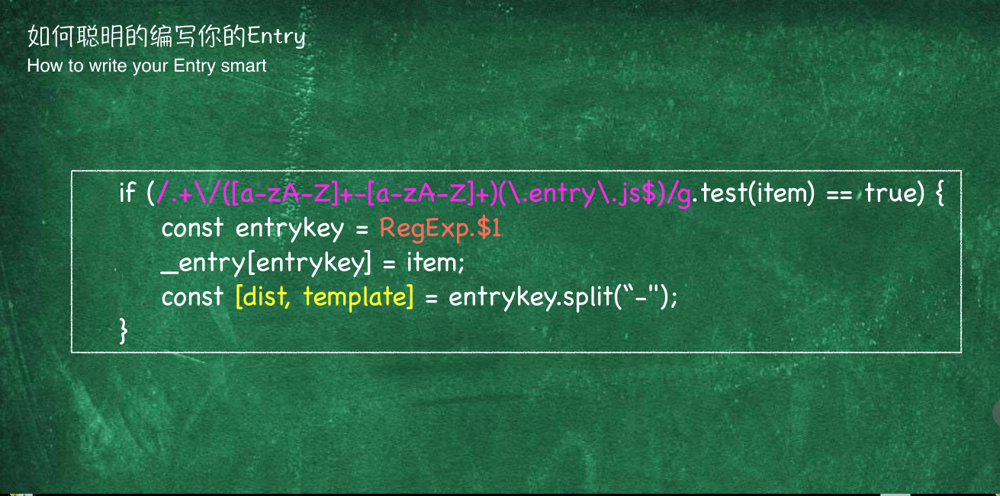
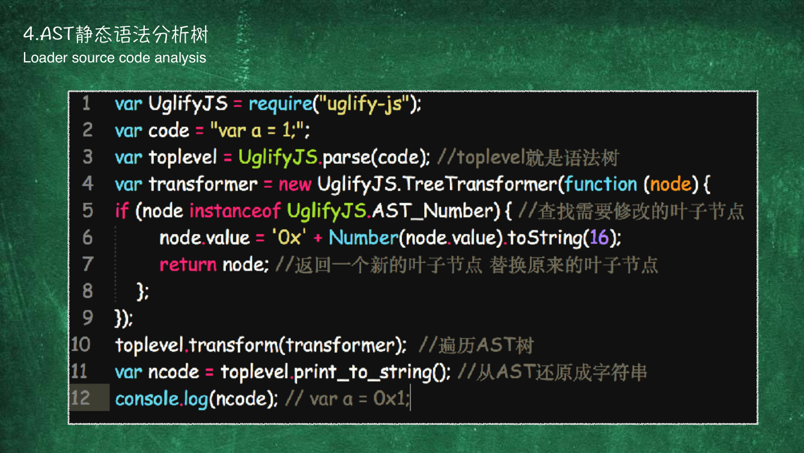
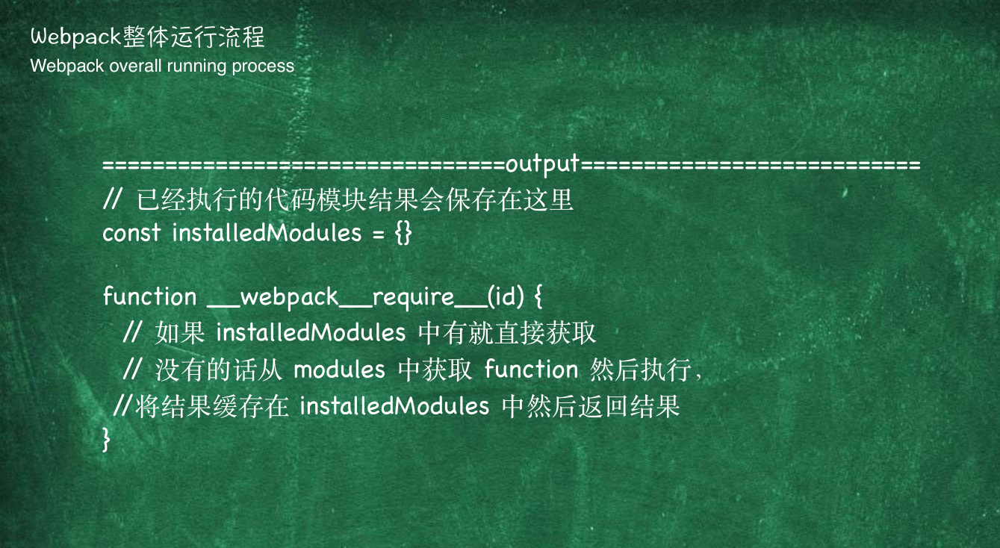
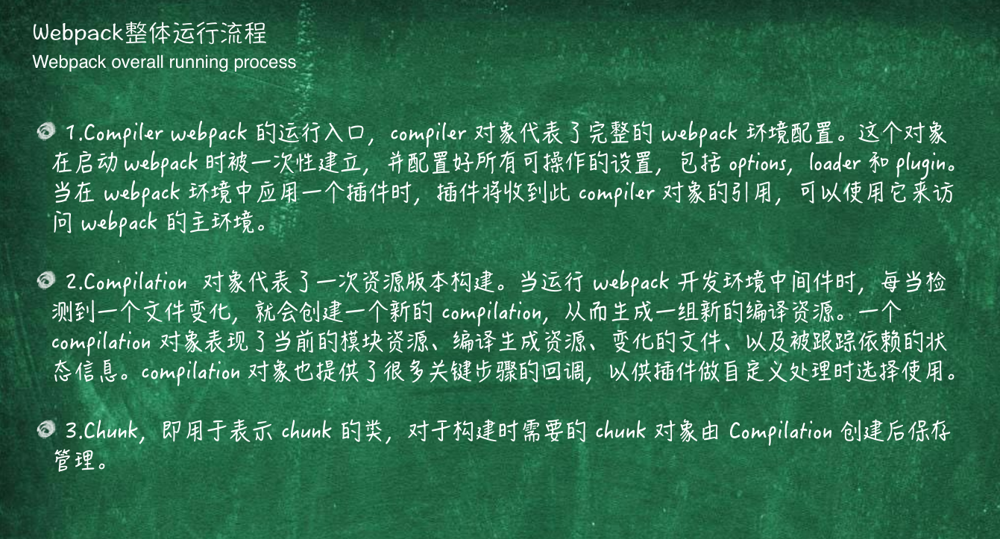

## webpack 解析



> happypack:多核打包，加快	打包速度    
> 原理 nodejs 多线程模块 cluster
#### AST(静态语法分析树)
> uglify ,acorn(webpack)


##### 为什么parcel比webpack 快？
> webpack 先解析成字符串 然后字符串解析成 AST(静态语法分析树)  (acorn)
> parcel 直接解析AST(静态语法分析树)

#### loader 
> Loaders是webpack提供的最激动人心的功能之一了。通过使用不同的loader，webpack有能力调用外部的脚本或工具，实现对不同格式的文件的处理，比如说分析转换scss为css，或者把下一代的JS文件（ES6，ES7)转换为现代浏览器兼容的JS文件，对React的开发而言，合适的Loaders可以把React的中用到的JSX文件转换为JS文件。

##### 实现机制
webpack 先解析成字符串 然后字符串解析成 AST(静态语法分析树)  (acorn)

```bash
moduel.exports=function(content,map,meta){
     console.log('得到的数据：‘， content);
     console.log('loader预选处理‘， this.data.value);
}

moduel.exports.pitch=function(r1,r2,data){
     data.value='hello moto';
}

```

#### Plugins
> 插件（Plugins）是用来拓展Webpack功能的，它们会在整个构建过程中生效，执行相关的任务
> Loaders和Plugins常常被弄混，但是他们其实是完全不同的东西，可以这么来说，loaders是在打包构建过程中用来处理源文件的（JSX，Scss，Less..），一次处理一个，插件并不直接操作单个文件，它直接对整个构建过程其作用。

```bash
	const pluginName = 'ConsoleLogOnBuildWebpackPlugin';
	class ConsoleLogOnBuildWebpackPlugin {//
			apply(compiler) {
			// 在 compiler的hooks中注册⼀个⽅法，当执⾏到该阶段时会调⽤
			compiler.hooks.run.tap(pluginName, compilation => { //运行时
				console.log("The webpack build process is starting!!!");
			});
		}
	}


	plugins: [
		new ConsoleLogOnBuildWebpackPlugin()
	]
```

##### 实现机制
webpack 利用了 tapable 这个库（https://github.com/webpack/tapable）来协助实现对于整个
构建流程各个步骤的控制。 tapable 定义了主要构建流程后，使用 tapable 这个库添加了各种各样的
钩子方法来将 webpack 扩展至功能十分丰富,这就是plugin 的机制。


### Webpack整体运行流程







##### webpack5 废除 happypack     

#### webpack性能优化：
> 经历多个web项目实战之后，归纳webpack缺陷
> 1.代码全量构建速度过慢，即使是很小的改动，也要等待很长时间才能查看更新与编译之后的结果（引入HMR热更新之后有明显的改进）
> 2.随着项目业务的复杂度增加，工程模块的体积也会急剧增大，构建后的模块通常要以M为单位计算
> 3.多个项目之间公用基础资源存在重复打包，基础库代码复用率不算太高
> 4.node的单进程实现在CPU计算型的loader中表现不佳
#### webpack 分析工具
webpack-bundle-analyzer：自动帮你计算出各个模块在你的项目中的依赖和分部情况

#### 优化建议：
> 1.利用dllPlugin 和dllReferencePlugin 预编译资源模块：因为npm包不会进行修改，所以构建的时候没必要每次都去解析
> 2.使用happypack 加速代码构建--开启多线程：happypack在编译过程中除了利用多进程的模式加速编译，还同时开启了cache计算，能充分利用缓存读取构建文件
> 3.增加uglify，在构建的时候发现，webpack build走到80%左右的时候，会发生很长时间的停滞，经测试对比发现正是uglifyJS在对我们output中的bundle部门进行压缩导致耗时过长，针对这块儿可以使用webpack-uglify-parallel 来提成压缩速度（才用多核并行压缩的方式）
> 4.配置external +libraryTarget，把各种库的源码external一下，使用了之后，webpack就不会去打包，加快速度
> 5.生成输出的文件要走chunkhash 而不用trunk
> 6.激活代码热更新功能HMR

## 版本更新

#### webpack4
> 另一个大的改变是webpack需要设置mode属性，可以是 development 或 production。
>  webpack4受Parcel打包工具启发，尽可能的让开发者运行项目的成本变低。为了做到0配置，webpack4不再强制需要 webpack.config.js 作为打包的入口配置文件了，它默认的入口为'./src/'和默认出口'./dist'，
>  webpack4删除了CommonsChunkPlugin插件，它使用内置API optimization.splitChunks 和 ** optimization.runtimeChunk **
>* 这意味着webpack会默认为你生成共享的代码块。其它插件变化如下:
>  NoEmitOnErrorsPlugin 废弃，使用optimization.noEmitOnErrors替代，在生产环境中默认开启该插件。
>  ModuleConcatenationPlugin 废弃，使用optimization.concatenateModules替代，在生产环境默认开启该插件。
>  NamedModulesPlugin 废弃，使用optimization.namedModules替代，在生产环境默认开启。
>  uglifyjs-webpack-plugin升级到了v1.0版本, 默认开启缓存和并行功能。

#### Webpack5展望
> 已经有不少关于webpack5的计划正在进行中了，包括以下：
>*  对WebAssembly的支持更加稳定
>* 支持开发者自定义模块类型
>* 去除ExtractTextWebpackPlugig插件，支持开箱即用的CSS模块类型
>* 支持Html模块类型
>* 持久化缓存


 